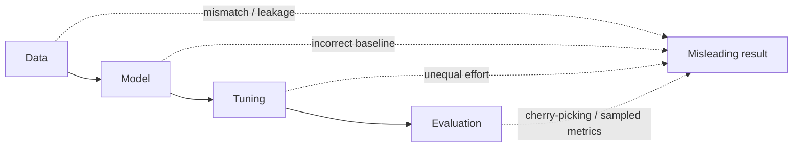

On 17 June, I had the pleasure of giving an invited talk to the Master of IT in Business (MITB) students at Singapore Management University (SMU) on **Reproducibility in Recommender Systems**. ([Slides here!](/uploads/reproducibility-in-recommender-systems/slides.pdf))

I started the talk with what ought to be a boring question:

> *"Who here doesn’t know BPR (Bayesian Personalized Ranking)? ...please don’t raise your hand!"*

Almost everyone working in recommender systems knows BPR (which had also been covered in a previous sessions of the class). Introduced in 2009 by Steffen Rendle and colleagues, BPR is one of the most foundational pairwise ranking algorithms in the literature. It is taught in university courses, implemented across almost all popular recommendation libraries, and routinely serves as the go-to baseline to this day.

Naturally, if you asked a researcher or a modern AI coding agent:

```text
Claude, help me build a BPR pipeline.
```

Would you feel confident that you are getting a standard, reproducible baseline?
Or more critically: would you get the best-performing BPR configuration on your benchmark?

It is great to see that the community has been putting more emphasis on reproducibility recently. I believe this is crucial for the progress of the field. In this post, I will share some of the widespread issues in the pipeline of recommender system research that can lead to irreproducible results.

---

## TL;DR: Your Recommender Model Is Only as Reproducible as Its Pipeline

A recommender-system result is not just an intrinsic property of the algorithm. It is a property of the **entire experimental pipeline**:



Flaws at any stage of the pipeline; from dataset selection and preprocessing to implementation details, unequal tuning effort, and evaluation choices; can dramatically alter the relative ranking of models:

| Step           | Common Example Flaw                                                                       | Likely Impact                                                                               | Practical Mitigation                                                                                                                             |
| :------------- | :---------------------------------------------------------------------------------------- | :------------------------------------------------------------------------------------------ | :----------------------------------------------------------------------------------------------------------------------------------------------- |
| **Data**       | Dataset-task mismatch, inconsistent preprocessing, temporal leakage                       | The benchmark measures an artificial problem, or the model learns information ahead of time | Document preprocessing; verify that the dataset exhibits true task signals; use time-respecting global splits                                    |
| **Model**      | Incorrect or incomplete baseline implementations                                          | A broken baseline makes a proposed model appear artificially superior                       | Prefer official/vetted implementations; audit loss calculations, sampling, and inference routines; sanity-check against published references     |
| **Tuning**     | Baselines receive default parameters while the proposed model gets extensive optimization | The ranking of models becomes a hyperparameter-budget artifact                              | Allocate comparable tuning budgets to all models; disclose search spaces, budgets, and selection criteria for both baselines and proposed models |
| **Evaluation** | Test-set model selection (cherry-picking) or sampled negatives                            | Optimistic performance estimates or completely inverted model rankings                      | Select checkpoints strictly on validation; evaluate on the full item space; disclose and stress-test sampling (only with good justification)     |

Let us examine how flaws emerge at each of these four stages.

---

## 1. Data: The Dataset May Not Match the Task

Before we even discuss model architectures, there is a more fundamental question: **what does our dataset actually tell us?**

### Sequential Data Needs Meaningful Order
In sequential recommendation, it has become common practice to take rating datasets (such as Amazon Reviews or MovieLens), sort each user's history by timestamp, and evaluate sequential models (like SASRec, BERT4Rec) using leave-one-out testing.

However, a sequence of ratings spread out over months or years does not automatically contain the sequential dynamics of an active e-commerce session where clicks happen seconds apart.

[Klenitskiy et al. (RecSys 2024)](https://arxiv.org/abs/2408.12008) tested this directly in *"Does It Look Sequential?"* by deliberately shuffling user interaction sequences across 15 commonly used benchmarks:
* If destroying temporal order barely hurts a sequential model, the dataset has very little sequential signal to begin with.
* Their results showed that many popular datasets exhibit minimal sequential dependencies, meaning complex sequential models were merely memorizing general popularity and user preferences rather than learning true ***sequential dynamics***.

### Temporal Data Leakage
Offline evaluation typically adopts one of three data-splitting strategies:

1. **Random Split:** Interactions are randomly partitioned. Test interactions are scattered across the entire timeline, allowing the model to train on future interactions to predict past behavior.
2. **User Leave-One-Out:** The last interaction of each user is placed in the test set. However, User A's last interaction may have occurred in January 2025, while User B's training interactions continue through December 2025. Consequently, interactions occurring long after User A's test event end up in the training data, allowing future signals to leak into past predictions.
3. **Global Temporal Split:** A single global timestamp cutoff is chosen. The model trains strictly on interactions before the cutoff and is evaluated on interactions occurring after it.

[Ji et al. (ACM TOIS 2023)](https://arxiv.org/abs/2010.11060) showed that non-temporal splits leak future training data, artificially inflating ranking metrics by **as much as 89.5% on NDCG@20** and overturning the relative performance ranking between models.

> **Takeaway:** Always ask *"what problem did I actually construct from this dataset?"*

---

## 2. Model: The Same Name Does Not Imply the Same Implementation

When comparing a new method against a familiar baseline, we often assume standard algorithms are identical across libraries. However, implementations of even classic (and conceptually simple) algorithms differ significantly across frameworks.

### BPR Implementations Are NOT the Same
[Milogradskii et al. (RecSys 2024)](https://arxiv.org/abs/2409.14217) audited BPR implementations across popular open-source frameworks (**Cornac**, **DaisyRec**, **Elliot**, **RecBole**, **ReChorus**, **RecPack**, **Implicit**, and **LightFM**):

| Framework                  | Core       | Item Biases |                     Regularization Scheme                     |  Optimizer  | Negative Sampling  |
| :------------------------- | :--------- | :---------: | :-----------------------------------------------------------: | :---------: | :----------------: |
| **Cornac**                 | Cython     |     Yes     |                       Shared $\lambda$                        |  Only SGD   |      Uniform       |
| **DaisyRec**               | Python     |     No      |                       Shared $\lambda$                        | Include SGD |      Uniform       |
| **Elliot**                 | Python     |     Yes     |          Separate $\lambda_u, \lambda_i, \lambda_j$           |  Only SGD   |      Uniform       |
| **RecBole**                | PyTorch    |     No      |                       Shared $\lambda$                        | Include SGD |      Uniform       |
| **Implicit**               | Cython     |     Yes     |                       Shared $\lambda$                        |  Only SGD   |  Popularity-based  |
| **LightFM**                | C / Cython |     Yes     |          Separate $\lambda_u, \lambda_i, \lambda_j$           |   No SGD    |      Uniform       |
| **Original (MyMediaLite)** | C#         |     Yes     | Separate $\lambda_u, \lambda_i, \lambda_j$ & Shared $\lambda$ |  Only SGD   | Uniform & Adaptive |

Differences in bias terms, regularization formulations, optimizer defaults, and negative sampling strategies resulted in substantial performance divergence. For example, on the Million Song Dataset (MSD), NDCG@100 varied widely under the same nominal algorithm:

* **Cornac:** $0.3114$
* **Implicit:** $0.2567$
* **LightFM:** $0.0575$
* **RecBole:** $0.0117$

The exact "same" algorithm yields vastly different results depending on the library, and the discrepancies are substantial.

By today's standards, BPR is a relatively simple algorithm with few implementation details. If the gap is already this wide for a basic baseline, the discrepancies in complex deep learning architectures can be catastrophic.

### Case Study: GRU4Rec
GRU4Rec ([Hidasi et al., 2016](https://arxiv.org/abs/1511.06939)) is a landmark sequential recommendation model with over 5,000 citations. The original reference was implemented in Theano. As Theano became deprecated, researchers created third-party ports in PyTorch, TensorFlow, and Keras.

[Hidasi and Czapp (RecSys 2023)](https://arxiv.org/abs/2307.14956) (the original authors of GRU4Rec) evaluated six third-party GRU4Rec implementations across five benchmark datasets:
* The most-starred PyTorch implementation on GitHub contained critical bugs in its loss functions (Cross-Entropy and BPR-max) and an incorrect inference routine.
* Out of the box, its performance was **75% to 99% lower** than the reference implementation.
* Meanwhile, a correct PyTorch reimplementation with only ~15 GitHub stars matched the reference within 1–2%.

> **Takeaway:** *An implementation is part of the experimental method.* When adopting a baseline, verify the correctness of every components, including model architecture, loss functions, sampling logic, optimizer, and inference process; not just the class name.

---

## 3. Tuning: With Enough Asymmetry, "Everyone's a Winner!"

Suppose a researcher spends three weeks fine-tuning a newly proposed model: sweeping learning rates, adjusting latent dimensions, testing regularizers, and tuning dropout. Then, they run the baselines using out-of-the-box default hyperparameters that were never tuned for that dataset. Such a comparison may be reproducible, but it is scientifically flawed.

In *"Everyone’s a Winner! On Hyperparameter Tuning of Recommendation Models"* ([Shehzad & Jannach, RecSys 2023](https://dl.acm.org/doi/10.1145/3604915.3609488)), the authors showed how conclusions about which recommender is "best" depend heavily on hyperparameter optimization budgets:

* When neural models are insufficiently tuned, even a non-parametric **`MostPop` (popularity baseline)** can outperform complex models like NGCF, ConvMF, and NeuMF on standard datasets (such as Epinions and AMZm).
* With unequal tuning, almost any proposed architecture can be made to look like a state-of-the-art winner.

A study by [Benigni, Ferrari Dacrema & Jannach (ACM TORS 2026)](https://arxiv.org/abs/2505.09364) examined 9 recommendation papers on Denoising Diffusion Probabilistic Models (SIGIR 2023 and 2024):
* Only ~25% of reported results were fully reproducible, often relying on comparisons against *weak or undertuned baselines*.
* When evaluated fairly, well-tuned simpler baselines consistently outperformed the diffusion-based models.

> **Takeaway:** Give competing models comparable optimization budgets, and report the full search space and selection process, not just the winning hyperparameter values.

---

## 4. Evaluation: Protocol Shortcuts Invert Conclusions

Evaluation determines what scientific claims an experiment actually supports.

The standard evaluation protocol is straightforward:
* **Training set:** Fit model parameters.
* **Validation set:** Tune hyperparameters, select model checkpoints, and apply early stopping.
* **Test set:** Measure final generalization performance ***strictly once***, after all modeling choices are frozen.

If test metrics are evaluated after every epoch and the peak score is reported (test-set cherry-picking), information from the test set leaks directly into model selection, producing artificially optimistic results.

### Negative Sampling at Inference
To reduce computation on large catalogues ($>100\text{k}$ items), many papers evaluate models by ranking each test item against a small sampled set of 99 negative items (1-in-100 evaluation) instead of the full catalogue.

[Krichene and Rendle (KDD 2020)](https://dl.acm.org/doi/pdf/10.1145/3394486.3403226) proved that:
1. **Sampled metrics are inconsistent:** Naively sampled metrics do not necessarily preserve the relative ordering of recommenders ($A > B$ under full evaluation can become $B > A$ under sampled evaluation, even in expectation).
2. **Metrics collapse toward AUC:** As sample size shrinks, ranking metrics (like Recall@$K$ and NDCG@$K$) behave increasingly like classification AUC rather than evaluating top-$N$ recommendation utility.

Full-catalogue evaluation should always be preferred unless explicitly studying a candidate retrieval stage with a well-defined candidate generator.

### Case Study: Neural Collaborative Filtering (NCF) vs. Matrix Factorization (MF)
Neural Collaborative Filtering ([He et al., WWW 2017](https://arxiv.org/abs/1708.05031)) proposed replacing linear matrix factorization dot products with non-linear Multi-Layer Perceptrons (MLP).

When [Rendle et al. (RecSys 2020)](https://arxiv.org/abs/2005.09683) revisited NCF with thorough hyperparameter tuning and standard dot-product baselines, **simple dot-product Matrix Factorization consistently outperformed or matched the learned MLP similarity models**. The apparent superiority of the neural interaction layers was driven by undertuned baselines and test-set epoch selection.

---

## Same Pattern, New Architecture, Every Year

This pattern has repeated across successive architectural paradigms in recommender systems:

* **2019 ([Ferrari Dacrema et al., RecSys'19 / TOIS'21](https://arxiv.org/abs/1907.06902)):** Out of 18 top-tier neural recommenders, only 7 could be reproduced. Simple heuristic baselines (ItemKNN, UserKNN, $RP_3\beta$) beat 6 of them, and none consistently outperformed a tuned linear model (SLIM). The 2021 TOIS extension confirmed this across 26 models.
* **2020 ([Rendle et al., RecSys'20](https://arxiv.org/abs/2005.09683)):** Standard dot-product Matrix Factorization (MF) outperforms Neural Collaborative Filtering (NCF / NeuMF) under equal hyperparameter tuning.
* **2022 ([Petrov & Macdonald, RecSys'22](https://arxiv.org/abs/2207.07483)):** Implementations of BERT4Rec are inconsistent, performance varied widely, with popular library implementations (e.g., RecBole) suffering up to a ~65% metric drop.
* **2023 ([Hidasi & Czapp, RecSys'23](https://arxiv.org/abs/2307.14956)):** Evaluated 6 third-party implementations of GRU4Rec; all were feature-incomplete and buggy, causing median metric drops of 7.5%–89.5% and maximum degradations up to 99.6%.
* **2023 ([Anelli et al., RecSys'23](https://arxiv.org/abs/2308.00404)):** Re-evaluated 6 Graph CF models (NGCF to LightGCN/GFCF); classic baselines ($RP_3\beta$, `EASE_R`) and non-iterative linear graph filters (GFCF) matched or outperformed deep GNNs, with GNN gains disappearing when moved beyond standard dense datasets.
* **2024 ([Milogradskii et al., RecSys'24](https://arxiv.org/abs/2409.14217)):** Analyzed BPR-MF across 6 open-source implementations (Cornac, Elliot, Implicit, LightFM, RecBole, MyMediaLite); implementation discrepancies degraded performance by up to 50%.
* **2025 ([Shehzad et al., SIGIR'25](https://arxiv.org/abs/2501.10143) / [Shehzad & Jannach, RecSys'25](https://dl.acm.org/doi/pdf/10.1145/3705328.3748156)):** In intent-aware recommendation (SIGIR'25), all 5 examined neural/graph models were consistently beaten by ItemKNN, SLIM, and `EASE_R`; in session-based GNNs (RecSys'25), a properly tuned GRU4Rec baseline outperformed 6 recent GNN architectures on 2 of 3 benchmarks.
* **2026 ([Benigni, Ferrari Dacrema & Jannach, ACM TORS'26](https://arxiv.org/abs/2505.09364)):** Diffusion-based recommenders (DDPMs) exhibited only 25% reproducibility across 9 SIGIR papers. Simpler baselines beat all reported results.

---

## Key Takeaways: How to Build Reproducible RecSys

Recommender system performance is the combined output of the complete experimental system:

$$\mathbf{Performance} = \mathbf{Data} + \mathbf{Algorithm} + \mathbf{Implementation} + \mathbf{Tuning} + \mathbf{Evaluation}$$

Published numbers in papers represent a single winning lap on a specific benchmark setup. When designing experiments or deploying models:

1. **Verify Your Data Assumptions:** Confirm that your dataset actually exhibits the signal you are modeling (e.g., sequential dynamics). Prioritize global over random temporal splits for time-sensitive tasks.
2. **Audit Baseline Implementations:** Do not blindly trust third-party ports. Verify loss functions, sampling strategies, and inference code. Check baseline numbers against established benchmarks.
3. **Budget Equal Tuning Effort:** Provide competing models with comparable hyperparameter search spaces and reasonable compute budgets. Disclose the full tuning procedure.
4. **Enforce Clean Evaluation Protocols:** Select hyperparameters and checkpoints strictly on the validation set. Evaluate on the full candidate set whenever possible.
5. **Publish the Full Pipeline:** Share end-to-end preprocessing code, baseline implementations, evaluation scripts, and seed configurations.

So, **trust, but verify.**
